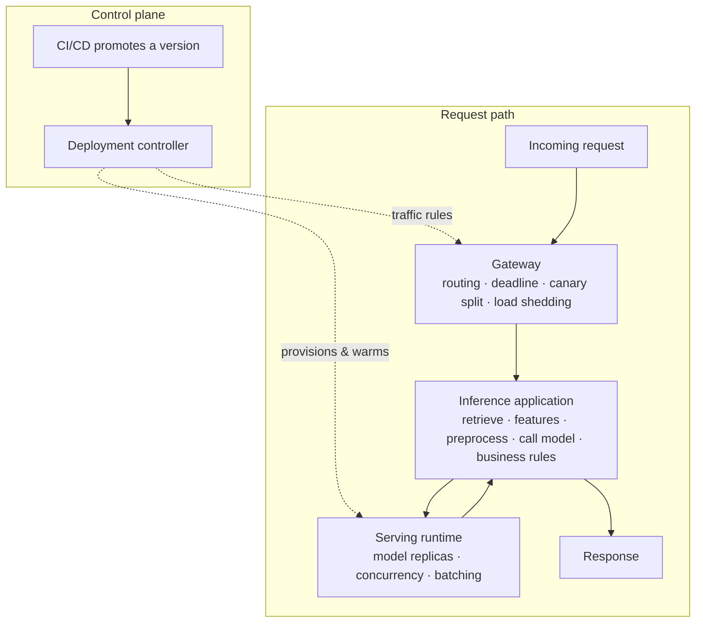
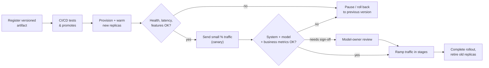
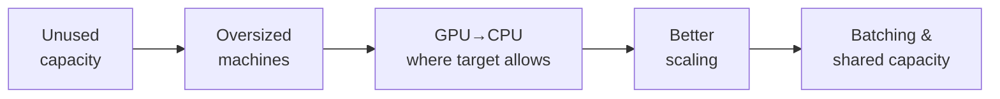
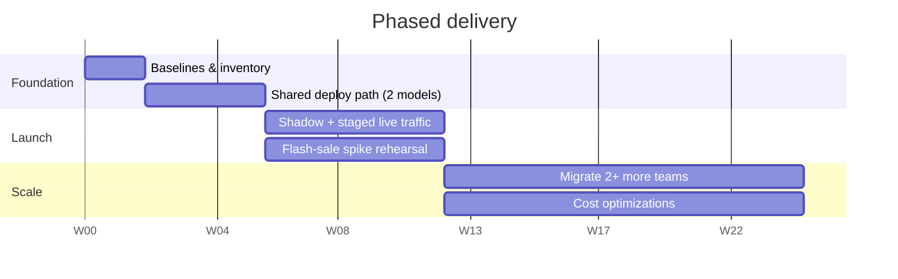

# Unified Model Serving & Cost Optimization Platform

Shared infrastructure to deploy, serve, monitor, and cost-optimize ML models across the organization's teams — replacing today's fragmented, per-team serving stacks with **one path to production** that still respects each model's latency and reliability needs.

---

## The Problem

The organization runs recommendations, dynamic pricing, fraud detection, search ranking, and personalization — each built and operated independently. The result:

- 💸 **Cost** — inference bill growing faster than revenue; duplicated GPU provisioning; idle capacity from manual scaling.
- 🐢 **Latency** — inconsistent SLAs (20ms to 500ms+) with no accountability.
- 🔍 **Visibility** — no shared view of cost-per-prediction, model health, or utilization.
- 🚨 **Spikes** — teams manually scale during flash sales and over-provision to stay safe.

## Goals

| # | Goal | Success signal |
|---|------|----------------|
| 1 | Launch Search Ranking + Personalization next quarter — **without** two new serving systems | Both live on the shared path |
| 2 | **30% inference cost reduction** in 6 months | Finance-verified against agreed baseline |
| 3 | Simple, reliable deploy / monitor / update / rollback for ML teams | Self-service, one-click rollback |
| 4 | **4+ ML teams** onto shared infra, meeting each model's SLA | ≥80% of inference traffic on-platform |

**Headline metrics:** total inference bill (did we hit the target?) and **cost per successful prediction** (explains changes in traffic and model mix).

---

## Architecture

Three request-handling layers, created and updated by a deployment controller — so we operate and measure the **complete customer request**, not just the model call.

| Layer | Owns | Does **not** do |
|---|---|---|
| **Gateway** | Route to app + version, apply deadline, stable/canary split, record start/success, shed load | Fetch features, pick a GPU |
| **Inference application** | The workflow DAG — parallel where independent, ordered where dependent; carries the deadline; fallbacks | Model-specific execution details |
| **Serving runtime** | Load model version; manage execution, concurrency, batching | Business logic |
| **Deployment controller** | Reconcile desired vs. running; warm replicas; check feature/dependency readiness; drive staged rollout | — |

### Serving runtime choices

These compose — they are **not** peers at the same level (e.g., KServe can manage a deployment running Triton).

| Choice | Likely use |
|---|---|
| **KServe** | Manage model deployments on Kubernetes, wired to a suitable runtime |
| **Ray Serve** | Multi-step inference apps whose steps scale separately |
| **Triton** | GPU models, including those that benefit from batching |
| **Simple model service** | CPU model that meets its target without a heavier stack |

> Pick the **smallest combination** that serves the two launch models well, based on what the organization already runs, validated with representative traffic.

### Safe deployment & rollout

One clear owner for traffic splitting, even when a serving tool ships its own canary feature. The app workflow and model version **move together** when they depend on each other — the controller checks feature/input/preprocessing readiness before live traffic.

---

## Cost Optimization Approach

Connect cloud billing, machine usage, GPU allocation, request counts, and model ownership → report cost **by model and team** (idle capacity included; training shown separately from the inference target).

Savings pursued in order of clear-waste-first:

End-to-end latency — feature lookups, preprocessing, queueing, model execution, postprocessing — is measured **per part** before optimizing. A fast model call doesn't make a slow app fast. Caching applies where time-sensitive data (prices, fraud signals) can be kept current.

---

## Roadmap

| Window | Focus |
|---|---|
| **Weeks 0–2** | Cost/service baselines; inventory models, traffic, owners, tools; confirm launch needs |
| **Weeks 2–6** | Shared deploy path for the 2 launch models — versioning, health checks, cost reports, rollback |
| **Weeks 6–12** | Run alongside current services → small live share → staged ramp + spike rehearsal |
| **Months 3–6** | Migrate 2+ more teams; apply measured cost improvements; ease onboarding for the next team |

---

## Cost-Aware Router (prototype)

Given requests (model version, priority, response-time limit) and mixed CPU/GPU machines (price, speed, load), the router:

| Step | Action |
|---|---|
| 1. Match | Healthy machines running the version, with free capacity |
| 2. Check time | Drop machines likely to miss the limit (from past latency at similar load) |
| 3. Choose cost | Route to the lowest-cost qualifying machine (CPU or GPU) |
| 4. Watch results | If a pool starts missing its target, shift new traffic to faster/less-loaded capacity and alert the owner |

No qualifying machine → request recorded as **unassigned** rather than hiding a likely failure. Reports requests served, missed limits, total cost, and **cost per successful prediction** per model — compared against always-cheapest and always-fastest baselines.

---

## Repository

| File | Contents |
|---|---|
| [`unified-model-serving-plan.md`](./unified-model-serving-plan.md) | Full plan write-up — goals, options, architecture, staging, ownership, outcomes |
| [`Intake.md`](./Intake.md) | Original case-study brief |

## Business Outcomes (6-month bar)

Judged by results, not features shipped:

- ✅ **Lower cost** — Finance-verified ≥30% reduction vs. baseline
- ✅ **Successful launches** — Search + Personalization live via the shared path
- ✅ **Reliable service** — each model meets SLA + availability, including spikes
- ✅ **Faster releases** — deploy/rollback with less manual platform work
- ✅ **Shared adoption** — 4+ teams running production workloads on the platform
