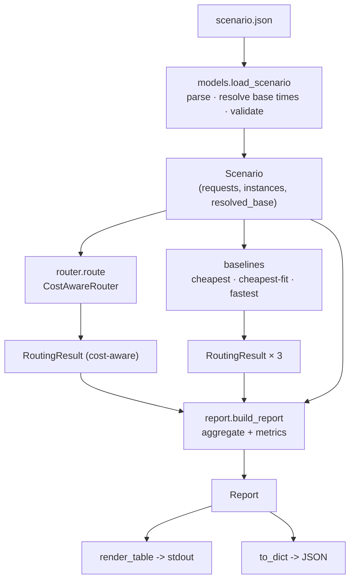
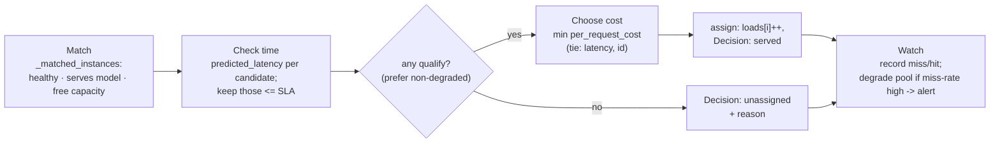

# Architecture — How the Prototype Tests the Routing Idea

This document explains how the code is organized and how the pieces fit together
to **prove** the cost-aware routing idea from
[`../unified-model-serving-plan.md`](../unified-model-serving-plan.md) §7. For
*how to run it*, see [`README.md`](./README.md); for the *design decisions*, see
[`../router-prototype-spec.md`](../router-prototype-spec.md).

## The idea being tested, in one sentence

> Given a batch of inference requests and a pool of mocked machines, does routing
> by **cheapest instance that still meets the latency SLA** beat naive policies on
> **cost per successful prediction** and **drop rate** — and can we prove it with
> numbers?

The whole program is a **deterministic simulator**: no real GPUs, no network, no
clocks. Everything is a pure function of the input scenario, so a run is
repeatable and the comparison against baselines is apples-to-apples.

## Design principles that shape the code

1. **Pure, deterministic core.** Given a scenario, routing and the report are
   fully determined. This makes the baseline comparison trustworthy and the tests
   golden-stable.
2. **One place per concept.** The latency/cost formulas live only in
   `latency.py`; the routing policy only in `router.py`; aggregation only in
   `report.py`. Swapping the latency model never touches routing.
3. **Fail loud, don't hide failures.** Unresolvable input is rejected at load
   time; a request with no SLA-meeting machine is recorded as `unassigned`, never
   silently sent somewhere it will miss.
4. **Router and baselines share the same primitives** (`_matched_instances`,
   `predicted_latency`, `per_request_cost`, request order), so differences in the
   report come only from *policy*, not from accounting differences.

## Module map

```
router/
  models.py         data model + loading + base-time resolution + validation
  latency.py        the two formulas: predicted latency, per-request cost
  router.py         CostAwareRouter — the policy under test (+ shared primitives)
  baselines.py      comparison policies (always-cheapest, cheapest-fit, always-fastest)
  report.py         aggregate decisions -> metrics -> table / JSON
  cli.py            wire it together for the command line
  logging_setup.py  structured logging to stderr
scenarios/          the experiments (inputs)
tests/              the assertions that the idea holds
```

### Dependency direction (leaf → root)

```
logging_setup ──┐
latency ────────┤
models ─────────┼──> router ──┐
                │             ├──> report ──> cli
                └──> baselines┘
```

Nothing depends on `cli` or `report`; the core (`models`, `latency`, `router`) has
no knowledge of how results are rendered. `baselines` reuses `router`'s shared
primitives so the two policy families are measured identically.

## What each module owns

| Module | Owns | Key names |
|---|---|---|
| `models.py` | The vocabulary and the trustworthy input. Dataclasses (`Request`, `Instance`, `Config`, `Scenario`), enums (`Priority`, `Kind`), **base-time resolution** (measured → default) and **validation**. | `load_scenario`, `scenario_from_dict`, `_resolve_base_times`, `_validate`, `Scenario.base_ms`, `ScenarioError` |
| `latency.py` | The physics proxy. Load-aware predicted latency and occupancy-time cost. The one place to swap for a fitted curve. | `predicted_latency`, `per_request_cost` |
| `router.py` | The policy under test + primitives every policy shares. The 4-step pipeline and the Watch state machine. | `CostAwareRouter`, `route`, `request_order`, `_matched_instances`, `_unassigned_reason`, `Decision`, `RoutingResult` |
| `baselines.py` | The straw men and the strong man to beat. | `always_cheapest`, `cheapest_fit`, `always_fastest` |
| `report.py` | Turning a list of `Decision`s into metrics and rendering them. | `build_report`, `_summary`, `render_table`, `Report`, `PolicySummary` |
| `cli.py` | Orchestration: load → route → baselines → report → print/JSON, plus exit codes. | `main`, `_run_route` |
| `logging_setup.py` | Logging config; logs to **stderr** so they never mix with the report on stdout. | `configure_logging` |

## How a run flows end to end



1. **Load (`models`).** `load_scenario` parses JSON, then **resolves** every
   servable `(instance, model)` pair to a base latency (measured if given, else a
   default, each tagged with its source), then **validates**. Bad input raises
   `ScenarioError` and the CLI exits non-zero. The result is an immutable-enough
   `Scenario` the rest of the program reads.
2. **Route (`router`).** `CostAwareRouter.route()` walks the requests in a fixed
   order and produces one `Decision` per request (see pipeline below).
3. **Baselines (`baselines`).** The same requests are re-run under three simpler
   policies, each returning its own `RoutingResult`. They reuse `router`'s
   `request_order`, `_matched_instances`, and the `latency` formulas, so only the
   *selection rule* differs.
4. **Report (`report`).** `build_report` aggregates all four `RoutingResult`s into
   per-model, per-priority, and per-policy summaries with the comparison metrics.
5. **Render (`cli`).** The table goes to stdout; `--json` also writes the machine
   form. Logs (defaults used, Watch alerts) go to stderr.

## The routing pipeline (the actual experiment)

`CostAwareRouter.route()` processes requests in `request_order` — priority
(`high→low`), then tightest SLA, then id — and simulates contention by
incrementing a local `loads` map as it assigns. For each request:



- **Match / Check time / Choose cost** map directly to plan §7 steps 1–3.
- **Watch** (step 4) is a small state machine: each matched instance's recent
  "would this have missed the SLA?" outcomes are kept in a rolling window; once a
  pool's miss-rate crosses the threshold it is marked *degraded*, an alert is
  emitted, and it is deprioritized so new traffic shifts away.
- Every request yields exactly one `Decision` (`served` | `missed_sla` |
  `unassigned`), which is the atom the report counts.

## How the idea is actually "proven"

The proof is a **controlled comparison** plus **metrics that can't be gamed**,
exercised by **scenarios** and locked by **tests**.

- **Baselines** (`baselines.py`) are the controls:
  - `always-cheapest` — cheapest hourly, ignores SLA (buys failures).
  - `cheapest-fit` — cheapest hourly *among SLA-meeting* instances (the strong
    baseline).
  - `always-fastest` — lowest latency, ignores cost.
- **Metrics** (`report.PolicySummary`):
  - `drop_rate = (missed_sla + unassigned) / total` — did we serve the demand?
  - `cost_per_success = total_cost / served` — cost per winner.
  - `effective_cost_per_request = (total_cost + drop_penalty × dropped) / total` —
    the **combined** metric that prices drops so a policy can't win by dropping the
    hard requests. The report ranks policies by it.
- **Scenarios** (`scenarios/`) are the experiments:
  - `simple.json` — sanity + a defaulted base time.
  - `flash-sale.json` — GPU/CPU under load: some requests unassigned, priority
    starvation, a Watch alert; shows the router beating naive cheapest on drops
    and effective cost.
  - `cost-tradeoff.json` — cheap-slow vs pricey-fast, both meeting SLA: isolates
    the router's win over `cheapest-fit` on pure cost (occupancy-aware selection).
- **Tests** (`tests/`) assert the properties rather than exact dollars, so they
  stay robust:
  - `test_latency` — formula correctness/monotonicity.
  - `test_router` — cheaper-qualifying preferred, SLA-missers dropped, unassigned
    reasons, priority ordering, Watch degradation, load contention.
  - `test_baselines` — cheapest can miss SLA; cheapest-fit spills past missers.
  - `test_report` — totals reconcile, combined metric math, and the **acceptance
    checks**: router's drop rate ≤ cheapest's, cost ≤ fastest's, and cost-aware
    beats cheapest-fit on `cost-tradeoff`.

Run the whole proof:

```bash
python3 -m unittest discover -s tests          # properties hold
python3 -m router.cli route scenarios/flash-sale.json     # see the comparison
python3 -m router.cli route scenarios/cost-tradeoff.json  # see the router's edge
```

## Extension points (where to plug realism in later)

| Want to change… | Touch only… | Nothing else changes because… |
|---|---|---|
| The latency/cost model (e.g. fit `1/(1-u)` from traces) | `latency.py` | Router calls it through two functions. |
| Add a new routing policy | add a picker in `baselines.py` (or a new class) | It reuses shared primitives + `Decision`. |
| Per-model drop penalty | `models.Config` + `report._summary` | The metric formula is isolated in `_summary`. |
| Base-time source (a real measurement store) | `models._resolve_base_times` | Router reads `Scenario.base_ms`. |
| Output format | `report.render_table` / `to_dict` | Aggregation is separate from rendering. |
