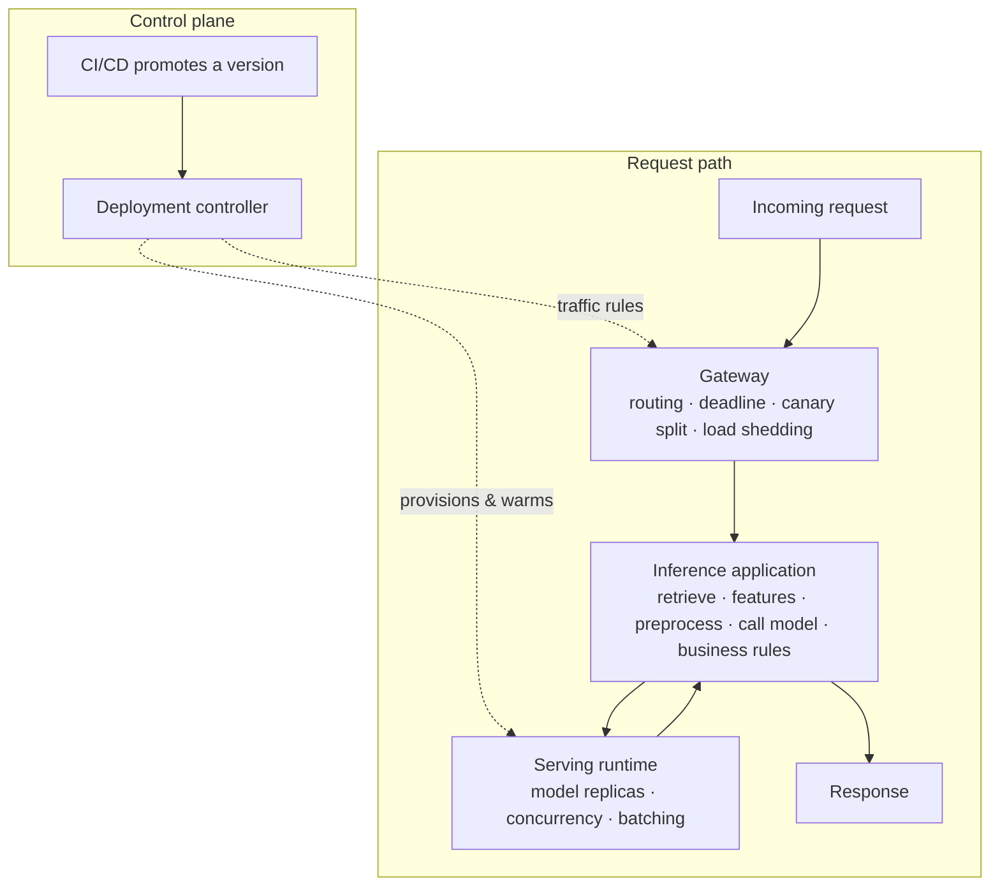
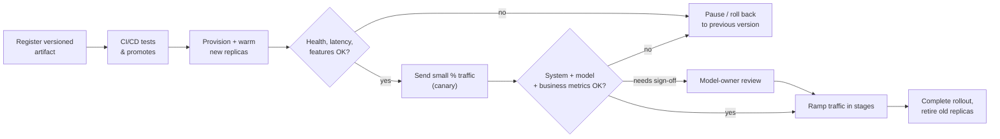
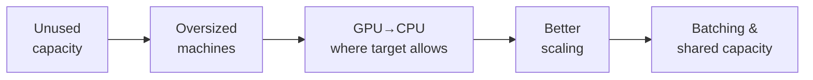
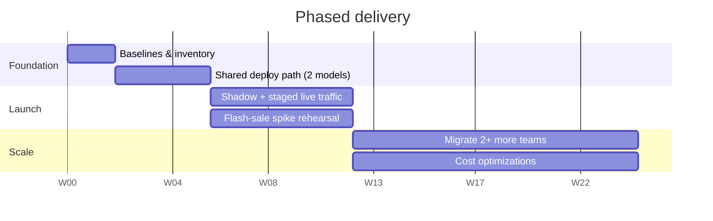
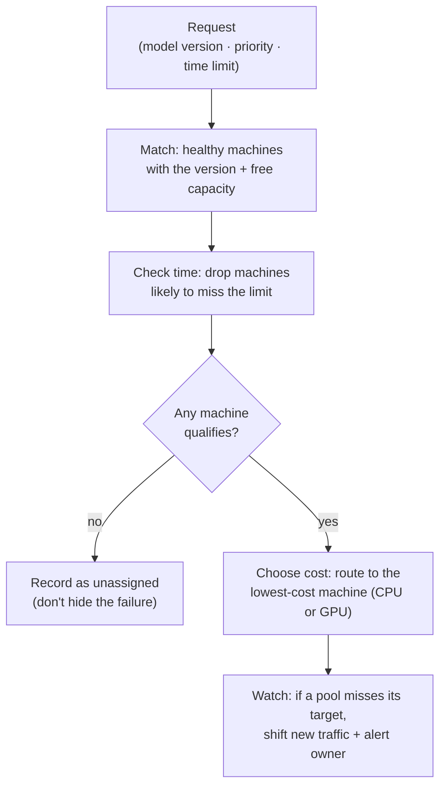

# Unified Model Serving Plan

**Sandeep Gupta**

## Goals

I would aim to deliver four results:

| # | Goal | Success signal |
|---|------|----------------|
| 1 | Launch the new Search Ranking and Personalization models next quarter — without creating two more separate serving systems | Both live on the shared path |
| 2 | Reduce inference cost by **30% within six months** | Finance-verified against the agreed baseline |
| 3 | Give ML teams a simple, reliable way to deploy, monitor, update, and roll back models | Self-service deploy + one-click rollback |
| 4 | Bring at least **four ML teams** onto the shared platform, meeting each model's latency and reliability needs | 4+ teams running production workloads |

I would measure both the total inference bill and the cost per successful prediction. The first shows whether we met the business target. The second helps explain changes in traffic and model mix.

## Process to Achieve the Goals

### 1. Understand the problem

Each team currently deploys and operates models in its own way. This creates duplicated capacity, uneven response times, and little visibility into cost or model health. During traffic spikes, teams add capacity manually and tend to keep more than they need.

The timing matters. Search and Personalization need a solution next quarter, while the platform team starts with only three engineers. I would spend the first two weeks measuring current workloads and costs, agreeing on service targets with model owners, and learning what serving tools the organization already has. I would confirm the definition of the 30% target with Finance before claiming any savings.

### 2. Consider the options

| Option | Benefit | Problem |
|---|---|---|
| Let each team deploy independently | Fast for each launch | Makes cost and operations more fragmented |
| Move every model to one new serving stack | Consistent infrastructure | Too much migration work and risk for three engineers |
| Share the deployment process, with a small choice of serving runtimes | Gives teams one path to production while meeting different model needs | Requires clear rules for which runtime and capacity each model uses |

I would choose the third option. It solves the immediate launch problem without assuming that a ranking model, a fraud model, and a batch job should all run the same way.

### 3. Build the first version

The platform should have three request-handling layers: a gateway, an inference application, and a model serving layer. A deployment controller creates and updates them. This lets us operate and measure the complete customer request, not just the model call.

At a glance, each layer's responsibilities:

| Layer | Owns | Does **not** do |
|---|---|---|
| **Gateway** | Route to app + version, apply deadline, stable/canary split, record start/success, shed load | Fetch features, pick a GPU |
| **Inference application** | The workflow — parallel where independent, ordered where dependent; carries the deadline; fallbacks | Model-specific execution details |
| **Serving runtime** | Load model version; manage execution, concurrency, batching | Business logic |
| **Deployment controller** | Reconcile desired vs. running; warm replicas; check feature/dependency readiness; drive staged rollout | Serve live requests |

The **gateway** receives the request. It identifies the application and version to use, applies a deadline, and routes traffic to the stable or canary version. It records when the request started and whether it succeeded. If the application is overloaded, it can limit or reject traffic according to an agreed policy. It does not fetch product features or choose a particular GPU.

The **inference application** owns the workflow. For Search, it might retrieve candidate products, fetch their features, prepare the model input, call a ranking model, apply business rules, and return the ranked results. Independent steps can run in parallel; steps that depend on earlier results run in order. The application carries the request deadline through every step, handles failed dependencies, and applies an agreed fallback when one is available.

I would provide common building blocks for feature access, tracing, deadlines, and fallbacks. Each ML team would still own the business logic of its workflow. A simple fraud model may need only input preparation, one model call, and response formatting.

The **model serving layer** executes the model call. It loads the requested model version and manages execution, concurrency, and batching. Different workloads may use different tools:

| Choice | Likely use |
|---|---|
| KServe | Manage model deployments on Kubernetes and connect them to a suitable model runtime |
| Ray Serve | Run an inference application with several processing or model steps that can scale separately |
| Triton | Execute suitable GPU models, including models that benefit from batching |
| Simple model service | Serve a CPU model when it meets the target without a heavier stack |

These tools are not all alternatives at the same level. KServe could manage a deployment running Triton. An inference application could call that deployment. Ray Serve could run both an application workflow and some of its model services. I would select the smallest combination that handles the two launch models well, based on what the organization already runs and tests with representative traffic.

The **deployment controller** turns an approved version into a running service. A model owner registers a versioned artifact. CI/CD tests it and promotes an approved version with its deployment specification. The controller then compares what should be running with what is actually running. It provisions the model in the selected serving runtime, starts and warms new replicas, checks their health and required features, and keeps the old version available.

The controller also manages the rollout. It updates the gateway's traffic rule so a small share of requests reaches the new version, watches health and end-to-end results by version, and increases traffic in stages. A failed health or latency check pauses the rollout or sends traffic back to the old version. Model-quality and business results may need more observations and sign-off from the model owner before the next stage. Once the new version is proven, the controller completes the rolling deployment and retires the old replicas. There should be one clear owner for traffic splitting, even if a serving tool also offers its own canary feature.

The application workflow and model version need to move together when they depend on each other. A new model may require a new feature, input shape, or preprocessing step. The controller should check those dependencies before sending live traffic to the new version.

We would measure the request from gateway entry to final response. One trace would show time spent in candidate retrieval, feature reads, preprocessing, queues, model execution, postprocessing, and network calls. We would also count the compute and data-service cost of those steps. A fast model call does not make an application fast if feature retrieval is slow.

The first cost improvements would come from that complete picture: remove repeated feature reads, batch lookups where useful, run independent calls in parallel, right-size replicas, and keep only the capacity needed for the service target. Later, with enough traffic data, we could tune runtime batching and replica choice using queue length, warm models, predicted execution time, and remaining deadline. We would compare estimated cost per request with the actual bill, including idle capacity. Any saving would have to preserve end-to-end response time and model quality.

### 4. Measure cost and improve it

I would connect cloud billing, machine usage, GPU allocation, request counts, and model ownership. The report would show cost by model and team, including machines kept running while idle. Training costs would be visible separately from the inference cost target.

I would look for savings in this order — clear waste first, complex scheduling last:

| Order | Lever | Why it comes here |
|---|---|---|
| 1 | Remove unused capacity | Pure waste — machines kept running while idle |
| 2 | Right-size oversized machines | Easy win once usage is visible |
| 3 | Move GPU→CPU where the target allows | Big unit-cost drop with no SLA loss |
| 4 | Better scaling | Match capacity to real demand, incl. spikes |
| 5 | Batching & shared capacity | Highest effort; needs traffic data and tuning |

This order lets us act on clear waste before investing in more complex scheduling.

Response time is more than model execution. Feature lookups, preprocessing, waiting in a queue, and postprocessing all count. I would measure each part before choosing an optimization. For example, reducing repeated feature lookups may help more than switching serving runtimes. Caching may help too, provided we can keep prices, fraud signals, and other time-sensitive data current.

### 5. Deliver in stages

| Window | Focus |
|---|---|
| **Weeks 0–2** | Agree on cost and service baselines. Inventory models, traffic, owners, and current tools. Confirm what Search and Personalization need to launch. |
| **Weeks 2–6** | Build the shared deployment path for those two models — versioning, health checks, basic cost reports, and rollback. Test under representative traffic. |
| **Weeks 6–12** | Run the new models alongside current services, then send a small share of live traffic. Increase traffic in stages and rehearse a flash-sale spike. |
| **Months 3–6** | Move selected models from at least two more teams. Apply the measured cost improvements and make deployment easier for the next team. |

A small live test may miss important customer groups or rare failures. Before increasing traffic, I would check both system health and model behavior across relevant groups. Errors and serious latency problems should stop a rollout immediately. Changes in clicks, conversion, pricing, or fraud outcomes need enough evidence and review with the model owner.

### 6. Assign ownership

With three engineers, I would cover serving and performance, deployment and reliability, and the model owner experience and cost data. I would work directly with the ML leads on priorities and launch decisions. Platform Engineering and SRE would help with shared infrastructure and operations; Finance would validate savings; Product and Analytics would help interpret customer outcomes.

I would request two more senior engineers for the later migration and optimization work. If hiring takes longer than expected, I would delay advanced scheduling and some migrations rather than put the two launches or service quality at risk.

#### Senior IC profiles I would consider

These are examples based on work the engineers have written or posted publicly. I have not worked with them, and I do not know whether they are available.

| Candidate | Role | Why relevant |
|---|---|---|
| **Rajat Shah** | Staff SWE, Netflix | Posted about model routing at Netflix and coauthored the underlying article — maps to a gateway that routes requests to the right model version while keeping the path reliable. |
| **Oleksandr Pryimak** | Staff SWE, Thumbtack | Wrote about building a shared inference service for teams previously on separate systems — directly maps to the need for one practical path to production across ML teams. |
| **Saurabh Vishwas Joshi** | Principal Engineer, Pinterest | Posted about Pinterest's move to GPU serving for recommendation models — relevant to choosing capacity and improving runtime efficiency while meeting response-time targets. |
| **Guangtong Bai** | Staff SWE, Pinterest | Posted about reducing network use in production ML and coauthored the article — focus on costs and delays outside model execution fits this plan's end-to-end measurement. |

### 7. Prove the routing idea

I would test the router with many requests for different models. Each request has a model version, priority, and response-time limit. The available CPU and GPU machines have different prices, speeds, and current loads.

| Step | What the router does |
|---|---|
| 1. Match | Find healthy machines that run the requested model version and have free capacity. |
| 2. Check time | Use past response times at similar loads to remove machines likely to miss the request's limit. |
| 3. Choose cost | Send the request to the lowest-cost machine left, whether CPU or GPU. |
| 4. Watch results | If that machine's pool starts missing its response-time target, send new requests to faster or less-loaded capacity and alert the owner. |

If no machine qualifies, the router records the request as unassigned rather than hiding a likely failure. It keeps the requested model version unless another version has been approved.

After routing all requests, the program would report requests served, missed time limits, total cost, and cost per successful prediction for each model. I would compare those results with always choosing the cheapest machine and always choosing the fastest one.

### Further work

After the first four teams are operating successfully, I would consider automated machine recommendations, better prediction of traffic spikes, and more sharing among low-traffic models. I would add each feature when its expected savings or benefit to model teams justifies the work.

## Business Outcomes

At six months, I would judge success by results rather than the number of platform features shipped:

| Outcome | Evidence |
|---|---|
| Lower cost | Finance verifies at least 30% lower inference spend against the agreed baseline; we also explain cost per successful prediction |
| Successful launches | Search and Personalization launch next quarter through the shared path |
| Reliable service | Each model meets its agreed response-time and availability targets, including during traffic spikes |
| Faster model releases | Teams can deploy and roll back a version with less manual platform work |
| Shared adoption | At least four ML teams run production workloads on the platform |

The platform succeeds if it makes model launches easier for teams, keeps customer-facing services healthy, and gives the organization a clear way to control inference cost.
